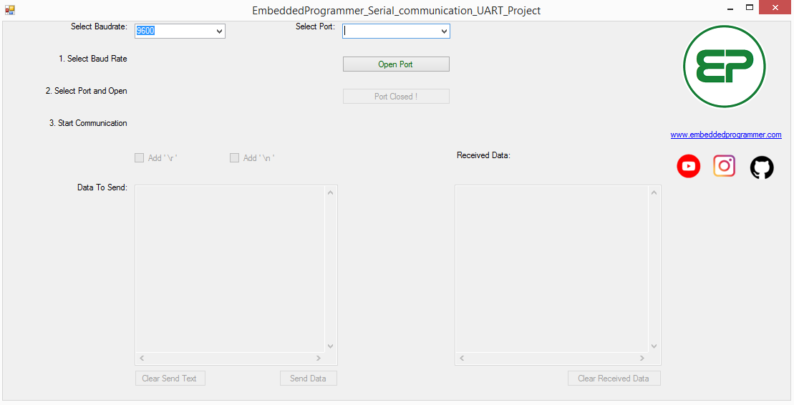
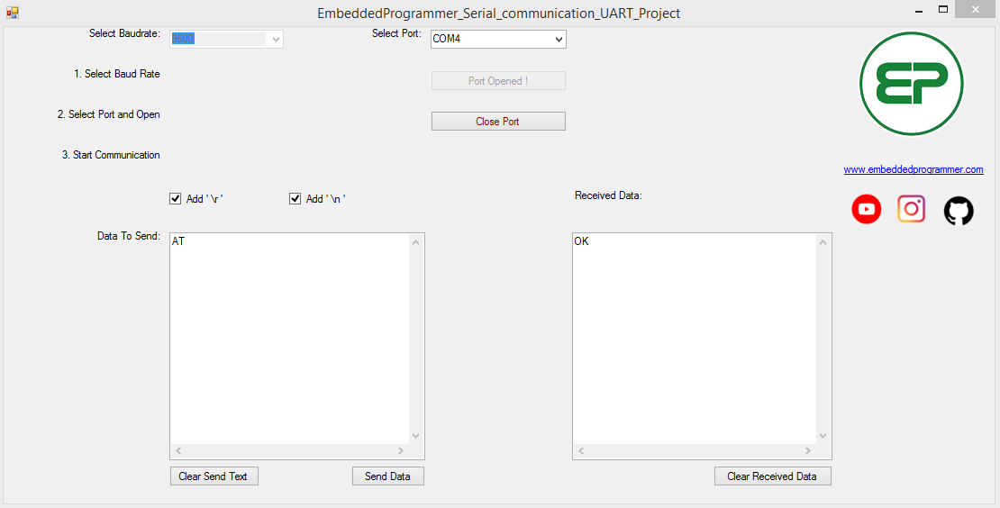

# UART Serial Communication
Serial Application for UART Communication 

- Select Baudrate
- Select Port and Press Open
- Start Communication 
  - You can Add Carriage Return '\r' and New Line '\n' at the end of your data  

